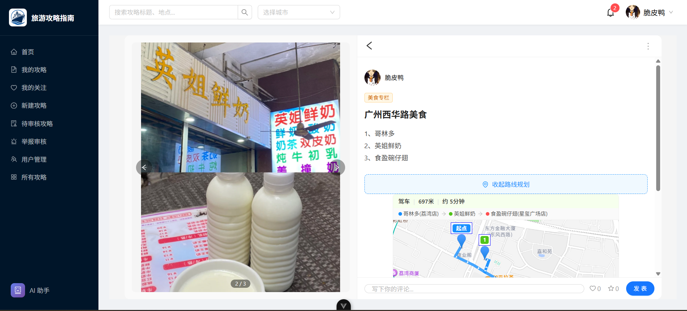
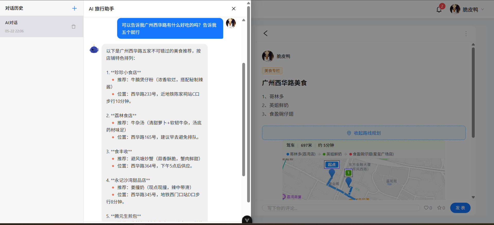
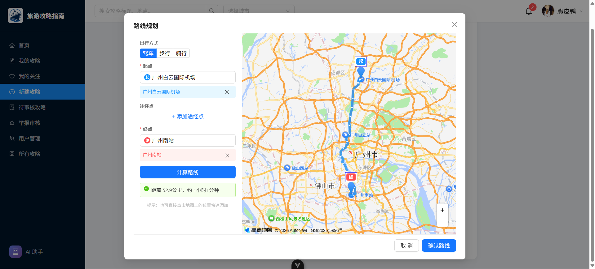
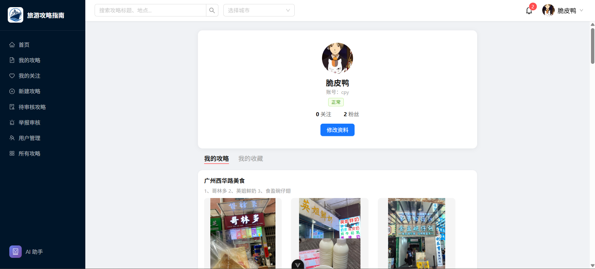

# 🗺️ TravelGuide · 旅游攻略平台

> 一个基于 Spring Boot + Vue 3 的全栈旅游攻略分享平台，支持 AI 智能旅行助手、高德地图路线规划、WebSocket 实时通知等丰富功能。


---

## 📸 系统截图

> **提示：** 以下为占位图片链接，请将您的截图文件放入 `assets/screenshots/` 或 `images/` 目录后替换路径。

| 首页 | 攻略详情 | AI 智能助手 |
|:---:|:---:|:---:|
|  |  |  |

| 路线规划 | 个人主页 | 后台管理 |
|:---:|:---:|:---:|
|  |  |  |

---

## ✨ 核心功能

### 👤 用户端
- **用户系统** — 注册 / 登录 / 个人信息编辑 / 头像上传
- **攻略管理** — 发布攻略（支持多图片上传、地点标签、路线规划） / 编辑 / 删除
- **互动功能** — 点赞、收藏、评论（嵌套回复）、关注用户
- **攻略浏览** — 首页时间排序 & 热度排序、按地点 / 标签筛选
- **AI 智能助手** — 基于 DeepSeek 大模型的旅游咨询对话（行程推荐、美食攻略等）
- **路线规划** — 接入高德地图 API，支持驾车 / 步行 / 骑行多途经点路线规划与展示
- **实时通知** — WebSocket 推送点赞、评论、收藏、系统通知
- **举报系统** — 举报攻略或评论，查看举报进度
- **手机扫码上传** — 手机扫码上传攻略图片，便捷高效

### 🔧 管理端
- **攻略审核** — 审核 / 拒绝用户发布的待审攻略
- **官方推荐** — 设置攻略为官方推荐（首页标记展示）
- **用户管理** — 查看用户列表、禁言 / 封号处理
- **举报审核** — 处理用户举报（成立 / 驳回）
- **全攻略概览** — 查看所有攻略状态，一键设为官方推荐

---

## 🏗️ 技术架构

```
┌─────────────────────────────────────────────────────────┐
│                    Frontend (Vue 3)                      │
│  ┌──────────┐ ┌──────────┐ ┌──────────┐ ┌──────────┐  │
│  │   Vite   │ │Ant Design│ │  Pinia   │ │Vue Router│  │
│  │   7.x    │ │  Vue 4.x │ │  State   │ │  Routes  │  │
│  └──────────┘ └──────────┘ └──────────┘ └──────────┘  │
├──────────────────────────┬──────────────────────────────┤
│        Axios + OpenAPI   │     WebSocket (通知推送)      │
├──────────────────────────┴──────────────────────────────┤
│                    Backend (Spring Boot)                 │
│  ┌──────────┐ ┌──────────┐ ┌──────────┐ ┌──────────┐  │
│  │Controller│ │ Service  │ │  MyBatis │ │  AOP     │  │
│  │  REST    │ │  层      │ │  -Flex   │ │AuthCheck │  │
│  └──────────┘ └──────────┘ └──────────┘ └──────────┘  │
│  ┌──────────┐ ┌──────────┐ ┌──────────────────────┐   │
│  │LangChain4j│ │WebSocket│ │   CosManager (COS)   │   │
│  │+DeepSeek │ │ Handler  │ │   文件上传层          │   │
│  └──────────┘ └──────────┘ └──────────────────────┘   │
├──────────────────────────┬──────────────────────────────┤
│     MySQL (持久化)        │      Redis (Session +       │
│                          │       AI 聊天记忆)            │
└──────────────────────────┴──────────────────────────────┘
```

### 后端技术栈
| 技术 | 说明 |
|------|------|
| **Spring Boot 3.5.14** | 基础框架 |
| **Java 21** | 运行环境 |
| **MyBatis-Flex** | ORM 框架（灵活查询构建） |
| **MySQL** | 关系型数据库 |
| **Redis** | 会话存储 + AI 聊天记忆 |
| **LangChain4j 1.12.x** | AI 服务集成 |
| **DeepSeek API** | 大语言模型（OpenAI 兼容接口） |
| **Spring WebSocket** | 实时通知推送 |
| **Tencent COS** | 对象存储（图片上传） |
| **Knife4j** | API 文档 |
| **Snowflake ID** | 分布式 ID 生成（MyBatis-Flex） |

### 前端技术栈
| 技术 | 说明 |
|------|------|
| **Vue 3 (Composition API)** | 前端框架 |
| **TypeScript 5.8** | 类型安全 |
| **Vite 7** | 构建工具 |
| **Ant Design Vue 4.x** | UI 组件库 |
| **Pinia** | 状态管理 |
| **Vue Router 4** | 路由管理 |
| **Axios** | HTTP 请求 |
| **高德地图 JSAPI** | 地图路线规划 |
| **@umijs/openapi** | OpenAPI 类型生成 |

---

## 🚀 快速开始

### 环境要求
- **MySQL** 8.0+（本地运行）
- **Redis** 7.0+（本地运行）
- **Node.js** 18+ & npm
- **JDK** 21+

### 1. 克隆项目

```bash
git clone https://github.com/yourusername/TravelGuide.git
cd TravelGuide
```

### 2. 初始化数据库

在 MySQL 中执行 `sql/create_table.sql` 创建数据库和表结构。

### 3. 配置后端

复制 `application.yml` 中的配置结构，创建 `application-local.yml`（已 gitignore），填入本地密钥：

```yaml
# application-local.yml
tencent:
  cos:
    secret-id: 你的腾讯云 SecretId
    secret-key: 你的腾讯云 SecretKey
    region: ap-guangzhou
    bucket: your-bucket

deepseek:
  api-key: 你的 DeepSeek API Key

amap:
  security-js-code: 你的高德地图安全密钥
```

### 4. 启动后端

```bash
# Windows
mvnw.cmd spring-boot:run

# macOS / Linux
./mvnw spring-boot:run
```

后端启动在 `http://localhost:8082/api`。

### 5. 配置前端

在 `TravelGuide-frontend/` 下创建 `.env` 文件：

```env
VITE_AMAP_KEY=你的高德地图JSAPI Key
```

```bash
cd TravelGuide-frontend
npm install
npm run dev
```

前端开发服务器启动在 `http://localhost:5173`，API 请求自动代理到后端。

### 6. 访问应用

打开浏览器访问 `http://localhost:5173` 即可开始使用。

---

## 📁 项目结构

```
TravelGuide/
├── src/main/java/com/oxiris/travelguide/
│   ├── ai/                    # LangChain4j AI 服务
│   ├── annotation/            # @AuthCheck、@StatusCheck 注解
│   ├── aop/                   # AOP 拦截器
│   ├── common/                # 统一响应、错误码、工具类
│   ├── config/                # CORS、COS、WebSocket、AI 配置
│   ├── controller/            # REST 控制器
│   ├── exception/             # 全局异常处理
│   ├── manager/               # COS 文件上传管理
│   ├── model/                 # DTO / Entity / VO / Enums
│   ├── service/               # 业务逻辑层
│   ├── mapper/                # MyBatis-Flex Mapper
│   └── websocket/             # WebSocket 处理器
├── src/main/resources/
│   ├── mapper/                # XML 映射文件
│   ├── prompt/                # AI 系统提示词
│   └── application.yml        # 主配置
├── sql/                       # 数据库建表脚本
└── TravelGuide-frontend/      # Vue 3 前端
    └── src/
        ├── api/               # API 调用层
        ├── components/        # 公共组件
        ├── layouts/           # 布局组件
        ├── pages/             # 页面组件
        ├── stores/            # Pinia 状态管理
        ├── router/            # 路由配置
        ├── utils/             # 工具函数
        └── types/             # 类型声明
```

---

## 🧭 主要功能模块

### 📝 攻略系统
攻略状态流：`待审核 → 通过 / 拒绝`。通过后的攻略展示在首页和地点页面，支持热度排序（结合点击、点赞、收藏、评论综合计算）。官方推荐策略在页面中有特殊标记。

### 🤖 AI 智能助手
基于 LangChain4j + DeepSeek 大模型，为每位用户维护独立的对话会话（最近 20 条消息缓存到 Redis）。支持旅行推荐、行程规划、美食指南等多轮对话。

### 🗺️ 高德地图路线规划
创建攻略时可规划多途经点路线（支持驾车 / 步行 / 骑行），路线分段计算确保途经点不被跳过。前端使用高德地图 JSAPI 渲染路线，后端代理 API 请求保护密钥安全。

### 🔔 实时通知
通过 WebSocket 实现点赞、评论、收藏、系统通知的实时推送。前端 NotifyBell 组件在导航栏显示未读数角标。

### 👑 权限管理
三层角色：`user` / `admin` / `superadmin`，用户状态：正常 / 禁言 / 封号。AOP 注解式权限校验与状态拦截。

---


## 🧪 开发命令

### 后端

```bash
# 构建（跳过测试）
mvnw.cmd package -DskipTests    # Windows
./mvnw package -DskipTests       # Unix

# 运行测试
mvnw.cmd test

# 启动应用
mvnw.cmd spring-boot:run
```

### 前端

```bash
npm run dev          # 开发模式（热重载）
npm run build        # 生产构建
npm run preview      # 预览生产构建
npm run lint         # ESLint 检查
npm run format       # Prettier 格式化
npm run openapi2ts   # 从 OpenAPI 生成类型定义
```

---

## ⚠️ 注意事项

- **ID 精度**：项目使用 Snowflake ID（19 位数字），超过 `Number.MAX_SAFE_INTEGER`，前端需以字符串形式处理，**切勿**使用 `Number()` 转换
- **密钥安全**：`application-local.yml` 和 `.env` 已 gitignore，请勿提交密钥到代码仓库
- **高德地图**：前端需要 `VITE_AMAP_KEY`，后端需要 `amap.security-js-code`，两者均需自行申请

---

## 📄 许可证

本项目基于 MIT 许可证开源。

---

> 💡 **旅游攻略平台** — 分享你的旅行故事，发现世界的精彩。
